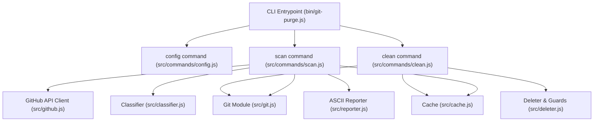

# Git-Purge (`git-purge-cli`) — Handoff Document (Phases 0, 1 & 2)

## 1. Project Overview & Architecture

**Git-Purge** is a safe, zero-data-loss Node.js CLI tool built to detect and remove dead local git branches by cross-referencing Pull Request states via GitHub REST API.

### Core Architecture Modules

---

## 2. Completed Phases Summary

### Phase 0: Setup & Scaffolding
- **CLI Skeleton**: Built with `commander` around `bin/git-purge.js` exposing `scan`, `clean`, and `config`.
- **Config Storage**: Implemented `src/config.js` storing the GitHub Personal Access Token at `~/.git-purge/config.json`.
- **Linter & Environment**: Set up ESLint 9 configuration (`eslint.config.js`) supporting standard ES module syntax in Node 20+.
- **Fixtures**: Confirmed execution of `scripts/setup-fixtures.sh` to generate the test repository fixture at `test/fixtures/repo`.

### Phase 1: Read-Only Scan (MVP)
- **Git Reader** (`src/git.js`):
  - Lists local branches and SHAs via `git for-each-ref`.
  - Determines current active branch via `git branch --show-current`.
  - Parses GitHub repository owner/name from HTTPS, SSH, and git remote URLs.
- **GitHub PR Matcher** (`src/github.js`):
  - Uses native `fetch` (no external HTTP dependencies).
  - Queries `GET /repos/{owner}/{repo}/pulls?head={owner}:{branch}&state=all`.
  - Fetches repository `default_branch` from `GET /repos/{owner}/{repo}`.
  - Monitors `X-RateLimit-Remaining` to pause before exhausting hourly limits.
- **Classifier** (`src/classifier.js`):
  - Categorizes branch state into: `"merged"`, `"closed"`, `"open"`, `"no-pr"`, `"needs-review"`.
  - **Crucial Squash-Merge Handling**: Correctly identifies squash-merged branches from GitHub PR state where local `git branch --merged` fails.
  - **Ambiguity Guard**: Flags branches matching multiple PRs as `"needs-review"`.
- **Cache Storage** (`src/cache.js`):
  - Writes scan results to `~/.git-purge/<repo>.json`.
  - Skips API calls on unchanged branches already classified as `"merged"` or `"closed"`.
- **Dry-Run Reporter** (`src/reporter.js`):
  - Formats branch statuses and metadata (`[current]`, `[default]`, `[unpushed work]`) in a clean terminal table.
  - Guarantees 0 branch deletions.

### Phase 2: Safe Delete (`clean` Command)
- **Hard Safety Guards** (`src/deleter.js`):
  1. **Current Branch Guard**: Never deletes or offers the active branch.
  2. **Default Branch Guard**: Never deletes the repo default branch (`main`/`master`), even if reported merged.
  3. **Unpushed Commits Guard**: Checks if the local branch contains commits not pushed to upstream/origin. If unpushed work exists, skips deletion and prints a warning.
  4. **Status Guard**: Only branches marked `"merged"` or `"closed"` are eligible for deletion.
  5. **Confirmation Enforcement**: Uses `prompts` library for interactive confirmation. The `-y, --yes` flag skips per-branch confirmations, but **never skips the final summary confirmation**.
- **Deletion Executor** (`src/deleter.js`):
  - Deletes confirmed branches using `git branch -D <branch>`.
  - Synchronizes cache by pruning deleted branches from `~/.git-purge/<repo>.json`.

---

## 3. Test Suite & Verification Results

All 32 tests across 7 test suites pass cleanly with zero linting warnings:

| Test Suite | Tests Passed | Coverage Area |
| :--- | :--- | :--- |
| `test/classifier.test.js` | 9/9 | PR classification, squash merges, closed/open/no-pr/ambiguity |
| `test/git.test.js` | 3/3 | Local branch inspection, current branch detection, URL parsing |
| `test/config.test.js` | 6/6 | Config read/write, token validation and retrieval |
| `test/cache.test.js` | 3/3 | Cache persistence, repo key sanitization |
| `test/cli.test.js` | 4/4 | CLI command help outputs and option flags |
| `test/scan.test.js` | 3/3 | End-to-end scan on fixture repo, classification accuracy, zero deletes |
| `test/clean.test.js` | 4/4 | Safe filter guards (default, current, unpushed), prompt aborts, deletion execution |

---

## 4. Assumptions Made

1. **Storage Structure**:
   - Stored global configuration in `~/.git-purge/config.json`.
   - Stored scan caches in `~/.git-purge/<owner>_<repo>.json` (sanitizing special filesystem characters).
2. **Default Branch Resolution**:
   - If GitHub API is unreachable for default branch detection, falls back to `main` with a diagnostic warning.
3. **Unpushed Commits Detection**:
   - If upstream tracking ref exists, compares commit count via `git rev-list @{upstream}..HEAD`. If no upstream tracking ref exists, checks against `origin/<branch>` or flags as unpushed work for local safety.
4. **Test Runner**:
   - Used **Vitest** for test execution.
5. **Headless & Programmatic Prompt Handling**:
   - Allowed an optional `promptHandler` in `performClean` so CI and integration tests can simulate user confirmations without hanging on interactive stdin.

---

## 5. Upcoming Phases (Next Steps)

- **Phase 3: Reliability**:
  - Implement full rate-limit pause logic testing (`X-RateLimit-Remaining < 50`).
  - Network-down fallback testing against existing cached scans.
  - Multi-PR ambiguous match flagging.
- **Phase 4: Polish & Ship**:
  - Final packaging & publish validation (`npm install -g git-purge-cli`).
  - GitHub Actions CI pipeline run.
